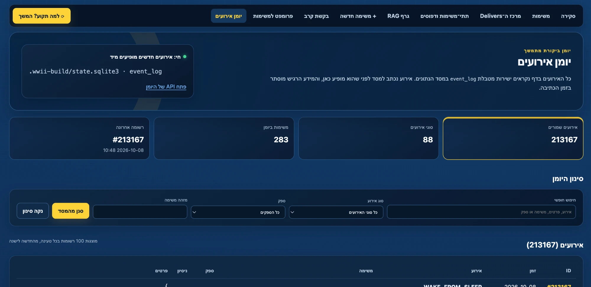
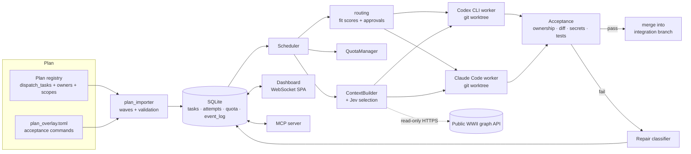
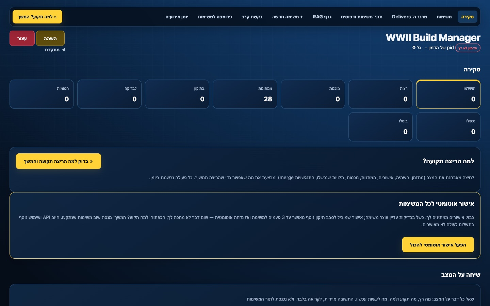
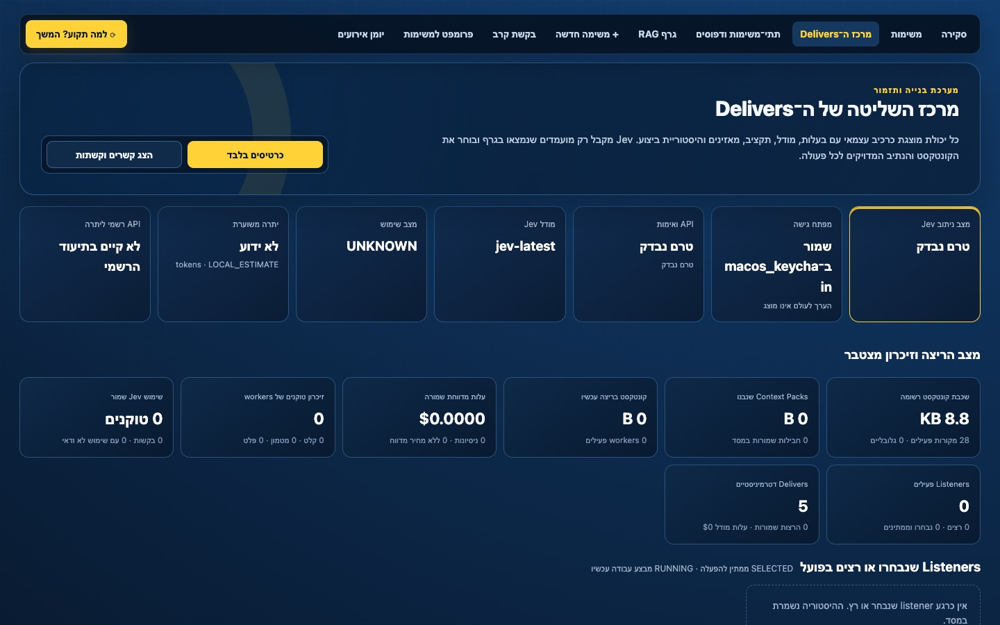

<div align="center">

# WWII Build Manager

**A deterministic orchestrator that runs Codex CLI and Claude Code CLI as sandboxed workers on a dependency graph of software tasks. Routing, quotas, acceptance, retries and repairs are handled by code, not by an LLM.**




<sub>The live dashboard on a real run: 283 tasks in flight and 213,167 journaled events. Every event is served straight from SQLite.</sub>

</div>

---

```
The plan defines the work.  The scheduler moves the work.  Models execute scoped tasks.
Tests decide what passed.   Quota decides when and where.  You can stop everything at any moment.
```

## Why this exists

I was building a large WWII simulation with many AI coding agents working in parallel. The obvious approach is
to let an LLM act as the project manager, and it fails in predictable ways:

* agents overwrite each other's files;
* nobody remembers which model is out of quota;
* "done" means "the model said so";
* a subscription quietly turns into a pay-as-you-go bill.

The Build Manager turns all of that into ordinary, testable code. **No LLM manages the queue.** A model is called
only to *execute* one bounded task. Choosing the task, the model, the context, whether the result is accepted and
when to retry are all deterministic decisions recorded in SQLite.

## What it does

| | |
|---|---|
| **Dependency-aware scheduling** | Imports a plan of tasks with owners, dependencies and write scopes, computes execution waves and runs up to N workers in parallel. Each worker runs in its own `git worktree` branched from an integration branch. |
| **Fit-based model routing** | Every task profile (IMPLEMENT, RESEARCH, DEEP, REVIEW, …) has a 0–10 fit score per model. The routing chain is the models sorted by fit, regardless of vendor. Ties break on cost tier, then remaining quota. Premium models always require human approval. |
| **Quota tracking without inference** | Reads Codex rate limits through a hard allow-list of `codex app-server` methods. Claude limits are learned from `rate_limit_event`s during runs, and unknown quota is shown as *unknown*, never guessed. A limit blocks only the model family it applies to, until its reset. |
| **Billing guards** | Workers get an allow-listed environment, so `ANTHROPIC_*` and `OPENAI_*` keys never leak into a child process. API-key auth is `BILLING_BLOCKED` by default. A Claude run that reports paid overage is stopped immediately. |
| **Deterministic acceptance** | After every run the manager checks write-scope ownership, `git diff --check`, secret scanning, dependency-file policy and handoff validity, then runs the task's own test commands. Tasks without tests go to `REVIEW_REQUIRED` instead of auto-passing. |
| **Repair instead of re-run** | A failed acceptance is classified first. Generated artifacts are cleaned up deterministically, code failures spawn a scoped `REPAIR/<task>/<n>` task with only the failing output as context, and contract-breaking changes escalate to a human. |
| **Context isolation** | Each run gets exactly the invariants, its own domain and role card, the brief, its registry entries and the *interfaces* of its dependencies. Sibling roles are excluded on purpose. Every prompt is saved with SHA-256 hashes of what went into it. |
| **Fail-closed context selection (Jev)** | Retrieval only *proposes* candidates. A separate selector (the TypeSafe SDK) must explicitly choose every context bundle before it reaches a prompt. If the selector is off or errors, no worker starts. |
| **Crash safety** | Every worker runs in its own process group under a `childguard` and is killed if the daemon dies. On restart, `reconcile` checks PID plus start time, commits unsaved worktree work and re-queues tasks. A `PASSED` task never runs again. Mac sleep is detected as `WAKE_FROM_SLEEP`. |
| **Live dashboard** | A no-build ES-module single-page app over a WebSocket (snapshot plus patch per topic), with an overview, a Delivers control center, task pages, an event journal, a planner and a Cypher/RAG console. Hebrew (RTL) and English. |
| **MCP server** | 38 tools (`task_*`, `deliver_*`, `planner_request`, `event_log_*`, `rag_graph_*`, …) share the dashboard's action path, so an agent can drive the manager with the same safeguards as a human. |

## Architecture



The optional graph link (dashed) goes to the **public, read-only** API of the companion
[`wwii-atlas`](https://github.com/pinchasrosenberg/wwii-atlas) project. The manager accepts only public HTTPS endpoints:
loopback, private-network and plain-HTTP addresses are rejected in code (`wwii_build/graph_rag.py`), and nothing is
configured by default.

## Quick start

Requirements: macOS or Linux, Python ≥ 3.11, git, and at least one of Codex CLI / Claude Code CLI logged in with a
**subscription** (not an API key).

```bash
git clone https://github.com/pinchasrosenberg/wwii-build-manager
cd wwii-build-manager

# A target repository with a plan in it. The real WWII game plan this was built for ships as an example:
git init ../demo && cp -R examples/ww2-game-plan/. ../demo/
git -C ../demo add -A && git -C ../demo commit -qm "plan"

alias wwii-build="$PWD/bin/wwii-build --repo $PWD/../demo"
wwii-build config init     # writes ../demo/.wwii-build/config.toml
wwii-build doctor          # git, CLIs, auth mode, models, flags, port. No inference.
wwii-build import-plan     # 28 tasks in 6 waves
wwii-build dry-run         # what would run now, on which model, with what context and why. No LLM call.
wwii-build dashboard       # http://127.0.0.1:8765
```

When you are ready to spend quota:

```bash
wwii-build baseline        # one-time: snapshot the plan into the wwii-build/integration branch
wwii-build start           # scheduler + dashboard. Ctrl-C = graceful stop, twice = kill
```

Control at any time: `pause`, `pause --interrupt-running`, `resume`, `stop`, `kill`, `approve <id>`, `retry <id>`,
`skip <id>`, `set-provider <id> <model>`.

### Optional: connect the public WWII graph

```toml
# .wwii-build/config.toml
[graph_rag]
url = "https://ww2-atlas-api.<account>.workers.dev"
```

Graph context then flows into prompts **only** after the selector picks it, and only for Delivers whose access policy
(`none` / `limited` / `full`) allows it. The free-form Cypher console additionally needs the API owner's key in
`WW2_GRAPH_CONSOLE_KEY`. Writing to the graph from the manager is disabled.

## Screenshots

| Overview | Delivers control center |
|---|---|
|  |  |

## Engineering notes

* **Zero runtime dependencies** beyond the standard library. The single optional package is the TypeSafe SDK for the
  context selector. The dashboard is plain ES modules served by `http.server` with a hand-written WebSocket layer
  (`ws.py`). There is no build step.
* **SQLite is the source of truth.** 24 forward-only migrations cover tasks, attempts, quota windows, repairs,
  Delivers, listeners, graph access and the event journal. All timers are absolute timestamps, so a sleeping laptop
  or a killed daemon resumes correctly.
* **Secrets never touch disk.** Logs and events go through `sanitize.redact`. A key typed into the dashboard is stored
  only in the macOS Keychain and handed to the SDK in memory.
* **Tests:** 342 Python tests (`unittest`) and JS tests for the SPA run against a fake CLI (`fakes/fake_cli.py`).
  They cover routing and fallback, quota parsing, context isolation, env scrubbing, crash recovery (the daemon is
  SIGKILLed mid-run), the WebSocket protocol and every dashboard page.

```bash
python3 -m unittest discover -s tests -p 'test_*.py'
```

## Repository layout

```
bin/                 wwii-build and wwii-build-mcp launchers
wwii_build/
  scheduler.py       main loop: waves, dispatch, reconcile, wake-from-sleep
  routing.py         fit-score routing, approvals, fallback chains
  quota.py           per provider/family quota state and backoff
  providers/         Codex + Claude adapters and rate-limit parsers
  context_builder.py scoped prompt assembly with provenance hashes
  jev.py             fail-closed context selection
  acceptance.py      deterministic checks + acceptance commands
  repair.py          failure classification and repair tasks
  worktrees.py       git worktree lifecycle, baseline, merges
  childguard.py      orphan-proof worker processes
  dashboard.py, live.py, ws.py, static/app/   the live dashboard
  mcp_server.py      MCP tools over the same action path
  graph_rag.py       read-only client for the public graph API
  migrations/        SQLite schema history
systems/             system manifests (components → Delivers)
examples/ww2-game-plan/   the real plan + context tree used as the demo
tests/               unittest + JS tests, fake CLI
docs/REFERENCE.he.md full operator reference (Hebrew)
```

## Related projects

* [**wwii-atlas**](https://github.com/pinchasrosenberg/wwii-atlas) is the interactive WWII atlas, together with its
  public knowledge graph and read-only API.
* [**roman-atlas**](https://github.com/pinchasrosenberg/roman-atlas) is a temporal atlas of the Roman Empire.

## License

MIT © Pinchas Rosenberg
