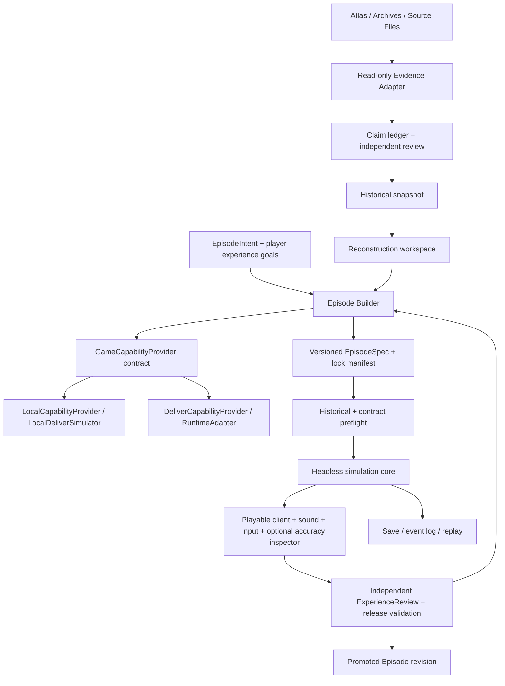

# WWII Living World — Unified Architecture

תאריך: 2026-09-27 · מצב: אפיון מאוחד ו־M0 contract proofs; לא משחק ממומש.

המוצר הוא **משחק של נוכחות בתוך עולם היסטורי חי**. השחקן שייך ליחידה, מכיר אנשים, מקבל החלטות מקומיות ויש לו סיבה להמשיך גם ברגעים שקטים. נאמנות היסטורית מאפשרת אמון בעולם; היא אינה תחליף למשחק. ממשק האטלס הוא מקור מחקר ונקודת כניסה לאפיזודות, לא תבנית לחוויית המשחק.

[המסמך המקורי](inputs/MASTER_SPECIFICATION.md) ו־[ההנחיות הנוספות, כולל Experience North Star ו־VR](inputs/USER_STEERING.md), הם מקור הדרישות. התכנון ניתן לשינוי כאשר קיימת ראיה לפתרון טוב יותר. שינוי מחייב החלטה רשומה, השפעת מעבר ובדיקת הדרישות שנשמרו.

## גבול המסירה הנוכחית

מסירה זו כוללת סריקת קוד, מחקר stack, חלוקת תחומים, חוזים, תכנון עולם/חוויה/היסטוריה/כלכלה, ביקורת עצמאית וסדר מימוש. הוכחות חוזים קטנות מותרות אחרי איחוד וביקורת. אין כאן השלמה של `EpisodeIntent → PlayableEpisode`, בניית מנוע מלא או אישור היסטורי לאפיזודה מסוימת. מצב מוכח נרשם ב־[VALIDATION_REPORT](VALIDATION_REPORT.md), וכל סעיפי הדרישות ממופים ב־[REQUIREMENTS_TRACEABILITY](REQUIREMENTS_TRACEABILITY.md).

## מסלול הקריאה

| החלטה | מסמך מוסמך |
|---|---|
| מה קיים והיכן | [REPO_MAP](REPO_MAP.md) |
| חוויית משחק, פרופילים ובדיקת עניין | [EXPERIENCE_DESIGN](EXPERIENCE_DESIGN.md) |
| מנוע ומעבר עתידי ל־VR | [STACK_EVALUATION](STACK_EVALUATION.md), [VR_READINESS](VR_READINESS.md) |
| בידוד וניתוב הקשר | [CONTEXT_ARCHITECTURE](CONTEXT_ARCHITECTURE.md) |
| תחומים ותפקידים | [DOMAIN_REGISTRY](DOMAIN_REGISTRY.md), [AGENT_ROLES](AGENT_ROLES.md) |
| הרכבת יכולות ונכסים | [LEGO_ARCHITECTURE](LEGO_ARCHITECTURE.md) |
| אילו חלקים לבנות, מי אחראי, מודל וחבילת קונטקסט | [קטלוג הלגו המלא](LEGO_BUILD_CATALOG_HE.md), [מרשם הרכיבים](LEGO_OWNERSHIP_REGISTRY.json) |
| אמת, שחזור ומקורות | [HISTORICAL_FIDELITY](HISTORICAL_FIDELITY.md) |
| אפיזודה וחוזים | [EPISODE_SCHEMA](EPISODE_SCHEMA.md), [JSON Schemas](../../schemas/game/contracts.schema.json) |
| Deliver ותמחור | [DELIVER_INTEGRATION](DELIVER_INTEGRATION.md), [ECONOMY_AND_PRICING](ECONOMY_AND_PRICING.md) |
| סימולציה ו־LOD | [SIMULATION_LOD](SIMULATION_LOD.md) |
| ביצוע ומגבלות | [IMPLEMENTATION_SEQUENCE](IMPLEMENTATION_SEQUENCE.md), [OPEN_PROBLEMS](OPEN_PROBLEMS.md) |

## עקרונות שאינם נתונים למשא ומתן

1. `HistoricalTruth`, `Reconstruction` ו־`GameplaySimulation` הם מחסנים וסמכויות שונים. הסימולציה אינה כותבת עובדות היסטוריות.
2. כל טענה משמעותית נושאת מקור, מיקום במקור, זמן, גרסה ואי־ודאות. תקינות JSON או שם `AtlasFact` אינם אימות.
3. פרט זול יכול להיות מקורב ומסומן; אסור לו לסתור ראיה חזקה. זהות הציוד החזותי תואמת לזהות המודל הפיזי.
4. עולם ו־NPCs פועלים גם מחוץ למבט השחקן. מידע מגיע עם עיכוב, נקודת מבט וגבולות ידיעה.
5. אירועים היסטוריים גדולים הם אילוצים מוצהרים. בחירות מקומיות, קשרים, פציעה ואובדן נשארים בעלי משמעות.
6. יכולות ואפיזודות הן גרסתיות. אפיזודה שנייה משתמשת באותו loader ובאותן יכולות; אפיזודה אינה plugin קוד חדש.
7. Game Runtime אינו מייבא internals של Driver/Deliver. רק adapter מחזיק ידע על פרוטוקול חיצוני.
8. כל פעולה בתשלום מקבלת quote לפני execution. מחיר מוסכם אינו משתנה בגלל חריגת עלות.
9. Context נבחר לאחר הרשאות וסינון, בחמש שכבות בלבד. הרחבה מפורשת; אין שכפול כל המסמכים לכל סוכן.
10. קבלה מחייבת בדיקות עצמאיות של היסטוריה, ארכיטקטורה, סימולציה, provenance **וחוויה אנושית**.

## גבולות המערכת וכיוון התלות

זהו גרף תלות של תוצרים, לא שרשרת סוכנים קשיחה. ה־builder מפרסם work לפי חוסרים; resolver מפעיל יכולות מוכנות עם הקשר מותר. ביצוע חוזר מזהה request+input digest; מגבלת rounds, תקציב ו־deadline מונעת מעגל בלתי נגמר.

Shared kernel מכיל IDs, יחידות SI, זמן/קואורדינטות, hash, provenance, גרסאות, אירועים וחוזים. הוא לא מכיל טנקים, דיאלוגים או פקודות Neo4j. שכבות המחקר נשארות Python; ליבת הסימולציה נפרדת מהתצוגה, ובחירת שפה/מנוע נקבעת ב־STACK_EVALUATION וב־spike. החוזה בין מחקר למשחק הוא חבילת JSON/נכסים נעולה. אין להוסיף FFI רק כדי לשמור Rust אם מנוע אחר מתאים יותר ל־VR. מעבר עתידי ל־VR הוא דרישה מפורשת: מעקב ראש/ידיים, מצלמה, קלט ותצוגת UI הם adapters שאינם משנים אמת היסטורית או קוד אפיזודות.

## שלוש סמכויות וזרימת שינויים

| שכבה | רשאי לכתוב | אסור להסיק |
|---|---|---|
| HistoricalTruth | importer + החלטת reviewer עם ראיות | plausibility או התנהגות במשחק הם עובדה |
| Reconstruction | builders עם הנחות ושיטת יצירה | confidence עולה רק בגלל תקציב/יופי |
| GameplaySimulation | מערכות tick ופעולות שחקן | אירוע gameplay משנה את ledger ההיסטורי |

מקור חדש יוצר claim/snapshot revision. planner מפיק diff של השפעה; validators מאשרים Episode revision חדש. save פעיל נשאר עם lock הישן. העברה אופציונלית דורשת migration עם מיפוי IDs, יחס לדמויות שנהרגו, שמירת מלאים ויכולת rollback. אין החלפת מפה/טנק במהלך משחק בלי מסלול migration מפורש.

## שינויים מנומקים מול תכנון היעד

| החלטה | נימוק | השפעת מעבר | דרישה נשמרת |
|---|---|---|---|
| certainty כצירים נפרדים, לא סולם יחיד | DOCUMENTED יכול גם להיות DISPUTED; VERIFIED אינו PROBABLE | importer מפענח tags; UI מציג כמה תגיות | כל שמונת המונחים זמינים ברמת שדה |
| evidence gateway מחמיר לפני שימוש באטלס | auto-promotion הקיים אינו אימות עצמאי | יבוא מפורש; אין שינוי הרסני בגרף | היסטוריה ושחזור נפרדים |
| quote money מופרד מתקציב tokens | מנגנון reservation קיים אינו marketplace | ledger חדש מאחורי adapter | מחיר קבוע, ספק סופג חריגה |
| Godot + OpenXR כבסיס זמני אחרי דרישת VR | מסלול XR מובנה ותהליכי אנימציה/תוכן משנים את מאזן הבחירה | אין משחק Rust קיים להעביר; schemas וגבולות הסימולציה נשמרים; הוכחת מכשיר ב־M1 | headless, automation, נוכחות ו־VR עתידי |
| experience gate + quality vector | דרישת North Star הנוספת | שדות schema ו־review נוספים בלבד | fidelity היסטורי נשאר תנאי סף |
| M0 proofs לפני playable slice | אין terrain טקטי/כוח אדם מאומתים מוכנים | חוסרים נחשפים לפני השקעת תוכן | לא מדווחים על prototype כמשחק גמור |

## הגדרת הצלחה

Architecture Done: כל הדרישות ממופות, חוזים מקושרים, ניגודים נפתרו או תחומים ב־gate, המלצת stack מנומקת, ספק מקומי ניתן לבדיקה ותוכנית מעבר מפורשת. First Slice Done: אפיזודה נטענת מנתונים; אפשר לשחק, לחוות אנשים/עולם ובחירה; מקור/שחזור ניתנים לבדיקה לפי רצון; validators עוברים; שחקנים רוצים להמשיך. רק היעד השני מוכיח את המוצר.
